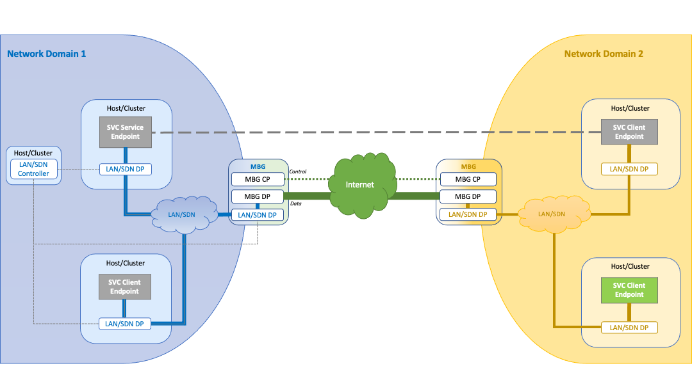

# Multi-cloud Border Gateway(MBG) project  
Through the Multi-cloud border gateway, users can simplify the connection between various application services that are located in different domains, networks, and cloud infrastructures. 
For more details, see the document: TBD 
This project contains two main components: 
1) MBG - THe Multi-cloud border gateway that allows secure connections between different services in different network domains.
   The MBG has different APIs like hello, expose and connect, enabling service connectivity.  
   The MBG can also apply some network functions (TCP-split, compression, etc.)
2) mbgctl - is CLI implementation that uses MBG APIs to send control messages to thr MBG.
   The mbgctl uses commands like expose, connect and disconnect to create connectivity to service in different network domains using the MBG. 




## <ins>Run MBG in local environment (Kind)<ins>
In this setup we build 4 clusters that run in local kind clusters: 
1) host cluster 
2) MBG1 (the mbg connect to the host domain) 
3) MBG2 (the mbg connect to the destination domain) 
4) destination cluster 

To run a Kind test, check all pre-requires are installed(Go, docker, Kubectl, Kind ): ```make prereqs```

1) Iperf3 Test - This test check iPerf3 connectivity and performance between the host cluster (iperf3-client) and destination cluster (iperf3-server).  
   * To Build the kind clusters and run the iPerf3 test:  
```make run-kind-iperf3```

1) BookInfo application Test- This test set [Istio BookInfo application](https://istio.io/latest/docs/examples/bookinfo/) on the host and destination clusters. The Product and details microservices run on the host cluster, and the Reviews and Rating microservices run on the destination clusters. 
   * To Build the kind clusters and run the bookInfo application:    
```make run-kind-bookinfo```  
   * The BookInfo application can be viewed by connecting to the Product microservice:  
```firefox http://<host-kind-cluster-ip>:30001/productpage```

## <ins>Run MBG in Bare-metal environment with 2 hosts<ins> 
Follow instructions from [Here](tests/bare-metal/commands.txt)

## <ins>Run MBG in cloud environment<ins> 
TBD
